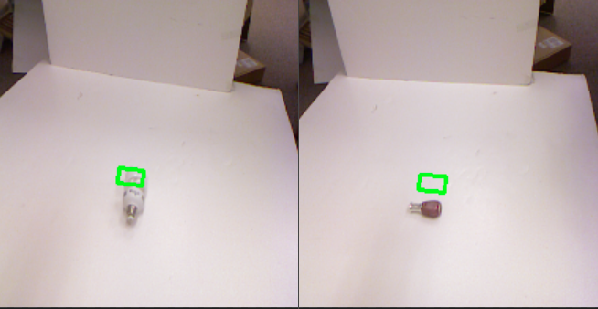
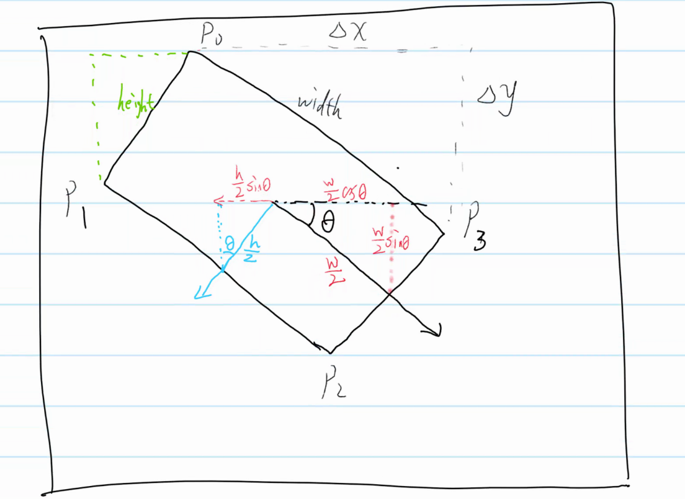
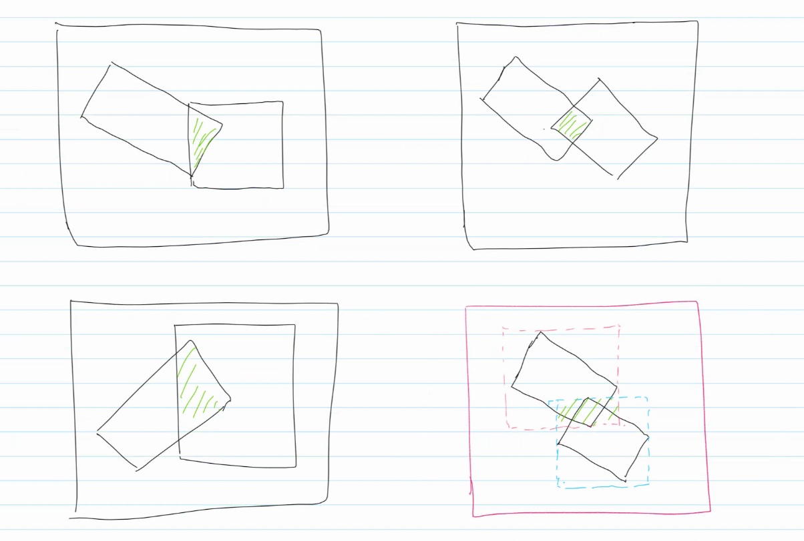
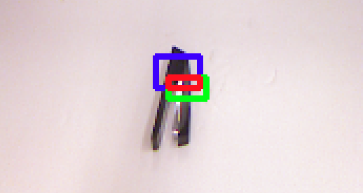
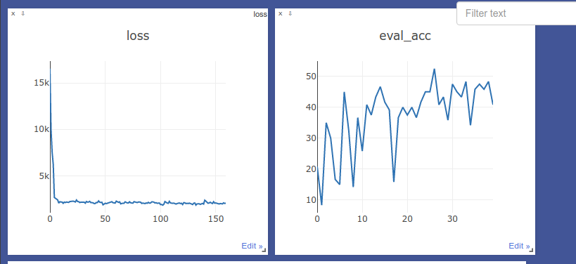
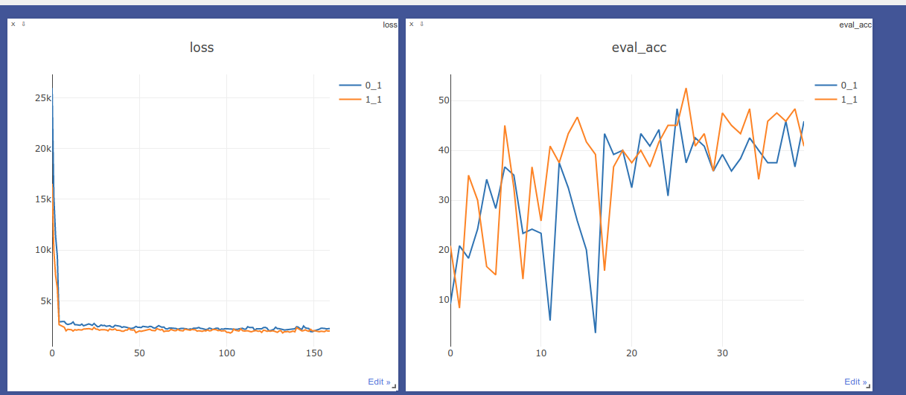

#### 介绍
- 本项目简单实现了机器人抓取框检测(robot-grasp-detection)，效果较差，不适合研究用途，只能简单应付课设

- 环境， cuda10.1/pytorch1.4
- 使用说明
```
./link.sh
make build          # 构造项目目录
make clean          # 清楚运行结果
./main.py train     # 训练
./main.py test --load-model-path=./checkpoints/xxx     # 测试
192.10.84.58:8057   # 浏览器打开网址，查看可视化结果
./utils/dataVisual.py   # 查看抓取框可视化结果
```

---

> 数据集说明 [CornellDataset](http://pr.cs.cornell.edu/grasping/rect_data/data.php)

```
1. Cornell数据集下下来有10部分，取前8部分作为训练集，后两部分作为测试集
2. 其中包含.png二维图片，cpos.txt正向抓取框描述，cneg.txt反向抓取框描述，仅使用.png与cpos.txt。
3. cpos.txt中对抓取框的描述为每行一个顶点的(x, y)，每4行描述抓取框的4个顶点
4. 数据集中部分顶点给的数值是NaN，详见pcd0132cpos.txt，会导致反向求导出错(已解决)
5. 运行utils/dataVistal.py 会绘制out/bbox.png，标签描述的抓取框
```

> 源码结构说明

```
.
├── checkpoints		模型参数，中间结果
├── config.py		参数配置
├── data			存放两个软连接 train test 指向自己组织的数据集
├── dataset.py		数据集组织
├── doc				存放参考的源码与论文
├── loss.py			自定义损失函数与评价指标
├── main.py			主函数 ./main.py train 训练
├── Makefile		C的构造工具，可去，此处为了便于删除重中间结果
├── models			模型文件，要添加的话，留一下__init__.py的导入即可
├── out				运行输出
├── README.md
└── utils			工具模块
```

> 大致做法

##### 1. 数据集处理

主要是标签的计算，将4个顶点描述转成论文中5维向量(x, y, $\theta$, width, height)，可以运行utils/dataVisual.py 查看，这部分代码独立



##### 2. 损失函数

1. tan($\theta$)数值会太大，使用torch.clamp做类似ceiling操作，但clamp函数会导致bp出错；

2. 可以用sigmoid/tanh压缩范围后再乘以系数，对标签和预测值同时压缩不会影响比较，这样压缩后$\sqrt10$这个系数待定；
3. 自定义loss可以是普通函数，只要返回值loss是张量类型的常量即可，继承nn.Module写成类的写法与框架一致
4. 这里简单采用MSE

##### 3. 评价指标

1. 给人看的，与训练无关，这部分带倾斜角的IoU不好算，训练时得到的输出，其大小和倾斜角都不一定，简单采用水平外接的矩形框代替



```
# acc += np.sum(RectAngleMetric(outputs, labels, imgIds, opt.train_data_root), axis=0)
解开注释，在loss.py里，drawRect(root, imgIds, [rect, rect_hat, rect_cross], "./out/rect", [(255,0,0), (0,255,0),(0,0,255)])会可视化出这三个框，红的为交集区域
```



2. 这个评价指标是有一定问题的，反映出来的准确率并不能很好的评价问题，因为对于同一张图片，标签里有多个抓取框，每次是随机选取一个框，不同框对应的标签可能差异很大(如果都只拿第一个框做标签容易过拟合，预测结果人为评价是更差的)



##### 5. 网络

论文中使用imagenet预训练网络，这个imagenet太大了，自己预训练比较困难，直接用的torchvision里预训练好的网络，这样子就把网络限死在了那几个经典网络，简单测试了下，损失函数下降差不多，不过vgg16特征提取能力强而且背景过于简单，目测效果更好


